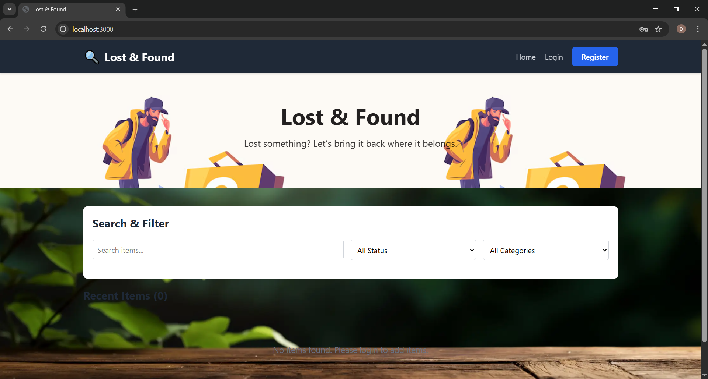

# Lost and Found Application

## Project Description
This is a Lost and Found web application where users can report lost items
and found items. It helps people reconnect with their belongings.

## Technologies Used
- Frontend: HTML, CSS, JavaScript
- Backend: Node.js, Express.js
- Database: Mongodb,mysql

## Features
- User Registration & Login
- Add Lost Item
- Add Found Item
- Search Items
- Admin Approval

## Final Output Screenshots

### Home Page

### Add Lost Item Page

### Login Page

## How to Run
1. Import database from `database/lost_and_found.sql`
2. Run backend server
3. Open frontend in browser

Home page:

Login page:

Register page:

Additem page:

Myitem page:

